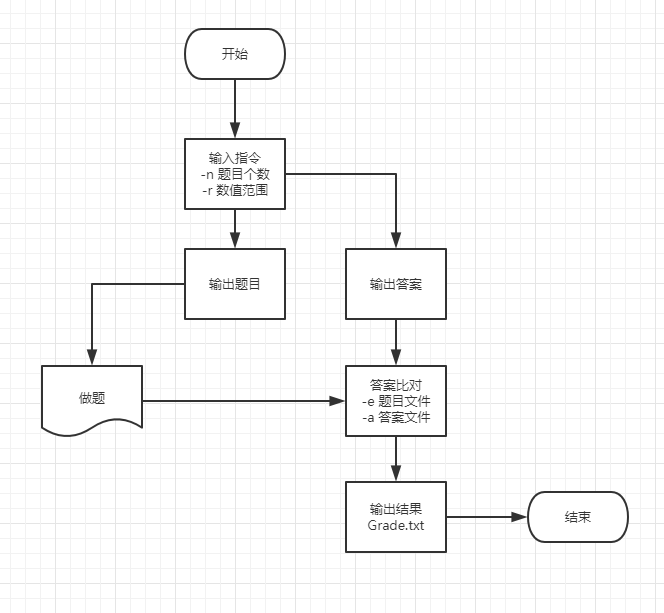

# 自动生成小学四则运算题目的命令行程序

博客地址：https://www.cnblogs.com/iggydog/p/12595085.html

## 说明：

运行Instruction.java生成算式

> 指令示例：
> 指定生成题目的个数，示例：-n 10 
> 指定题目中数值的范围，示例：-r 10
> 对给定的题目文件和答案文件，判定答案中的对错并进行数量统计，示例：-e <exercisefile>.txt -a <answerfile>.txt
> 输入题目数量、数值范围以获得练习题，或者输入判定答案指令进行答案批改

类、函数之间关系


## 需求：

### 	一、指令识别

> ​	1、使用 -n 参数控制生成题目的个数，例如 
>
> ```
> 	Myapp.exe -n 10
> ```
>
> ​	2、使用 -r 参数控制题目中数值（自然数、真分数和真分数分母）的范围，例如
>
> 		Myapp.exe -r 10
>
> ​	3、对给定的题目文件和答案文件，判定答案中的对错并进行数量统计，输入参数如下：
>
> 		Myapp.exe -e <exercisefile>.txt -a <answerfile>.txt


### 	二、算式生成

> 1. 生成的题目中计算过程不能产生负数，也就是说算术表达式中如果存在形如e1− e2的子表达式，那么e1≥ e2。
> 2. 生成的题目中如果存在形如e1÷ e2的子表达式，那么其结果应是真分数。
> 3. 每道题目中出现的运算符个数不超过3个。
> 4. 程序一次运行生成的题目不能重复，即任何两道题目不能通过有限次交换+和×左右的算术表达式变换为同一道题目。例如，23 + 45 = 和45 + 23 = 是重复的题目，6 × 8 = 和8 × 6 = 也是重复的题目。3+(2+1)和1+2+3这两个题目是重复的，由于+是左结合的，1+2+3等价于(1+2)+3，也就是3+(1+2)，也就是3+(2+1)。但是1+2+3和3+2+1是不重复的两道题，因为1+2+3等价于(1+2)+3，而3+2+1等价于(3+2)+1，它们之间不能通过有限次交换变成同一个题目。


### 三、文件输出

#### 	1、题目

> ​	生成的题目存入执行程序的当前目录下的Exercises.txt文件，格式如下： 
>
> ​		1、四则运算题目1
>
> ​		2、四则运算题目2
>
> ​		……
>
> ​	其中真分数在输入输出时采用如下格式，真分数五分之三表示为3/5，真分数二又八分之三表示为2’3/8。


#### 	2、答案

> ​	在生成题目的同时，计算出所有题目的答案，并存入执行程序的当前目录下的Answers.txt文件，格式如下：
>
>  
>
> ​		1、答案1
>
> ​		2、答案2
>
>  
>
> ​	特别的，真分数的运算如下例所示：1/6 + 1/8 = 7/24。


### 四、判断对错

> ​	统计结果输出到文件Grade.txt，格式如下：
>
>  
>
> ​		Correct: 5 (1, 3, 5, 7, 9)
>
> ​		Wrong: 5 (2, 4, 6, 8, 10)
>
>  
>
> ​	其中“:”后面的数字5表示对/错的题目的数量，括号内的是对/错题目的编号。为简单起见，假设输入的题目都是按照顺序编号的符合规范的题目。


### 五、附加需求

​	1、程序应能支持一万道题目的生成。

​	2、不符合输入规范时报错


## 流程图

> 